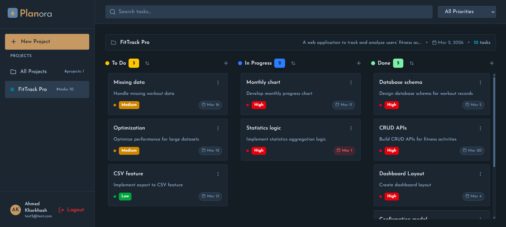
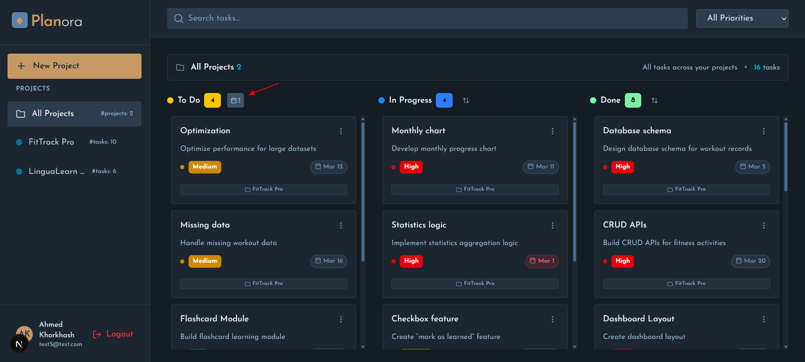
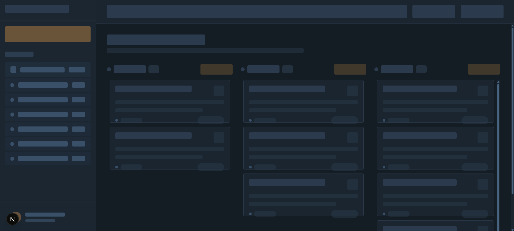

# Planora

A high-performance project management platform built with **Next.js 16** App Router, **React 19**, and **Supabase**. Planora leverages modern web patterns to deliver a seamless, low-latency and highly responsive Kanban experience.

## 🚀 Tech Stack & Key Features

- **Full-Stack Kanban Board:** Interactive task management with real-time feedback.
- **Optimistic UI:** Instant state updates for task creation and updates using React 19's `useOptimistic`.
- **Advanced Filtering & Sorting:** Debounced real-time search with priority/status filtering, synchronized with URL query parameters for persistent and shareable views, plus task sorting by creation time (default), earliest due date, or latest due date.
- **Secure Authentication:** Multi-strategy auth flow using Supabase Auth with **Proxy-based route protection**.
- **Database & Auth:** Supabase (PostgreSQL) with Row Level Security (RLS), including a **database View that joins projects with aggregated task counts** for efficient dashboard data retrieval.
- **Performance:** Optimized using **React Suspense**, **lazy loading**, Skeleton loaders, Selective Hydration, and efficient server-first data fetching for fast Time To Interactive (TTI).
- **Styling:** Tailwind CSS.

## 🏗️ Architecture & Technical Decisions

- **Server-Side Rendering (SSR) with React Server Components (RSC):** Utilized for the majority of data fetching to reduce client-side JavaScript bundles and improve TTI (Time to Interactive).
- **Server Actions:** All mutations (Create, Edit, Delete) are handled via Server Actions.
- **Streaming & Suspense:** Granular loading states via `loading.tsx` and custom `DashboardSkeleton.tsx` for a "perceived performance" boost.
- **Structured Data Flow:**
  - `_actions/`: Centralized server-side logic and database mutations.
  - `_lib/`: Shared business logic, data fetching services, and validation schemas.
  - `_dataTypes/`: Centralized TypeScript interfaces to ensure end-to-end type safety.

- **Modular UI:** Atomic component design (Modals, Inputs, Buttons) for high reusability and maintainability.

## 📸 Screenshots

---

### 🔐 Welcome and Authentication Page

Customized Design for A Welcome Page. Secure authentication flow powered by Supabase Auth with protected routes and Proxy-based access control.


---

### 🧩 Kanban Board Overview

The main dashboard displaying projects and tasks organized in a Kanban board.
Tasks are grouped by status (**To Do / In Progress / Done**) with visible priorities, actions (Edit, Delete) and due dates (highlighted in red if overdue in **To Do** or **In Progress**).

View 1 of showing task distribution:



View 2 of showing task distribution:


All Projects view:


---

### 📝 Project/Task Modal (Create / Edit)

Modal used for creating and editing projects and tasks.  
Includes project name, project description, task title, task description, priority selection, due date, and status updates with optimistic UI.


---

### 🔍 Advanced Filtering & Sorting

## Filtering and search state are synchronized with URL query parameters (e.g., `?priority=medium`, `?search=for`) to enable shareable, bookmarkable, and persistent dashboard views.

Filter tasks by priority and keyword search (debounced), with state persisted via URL query parameters.
Sort tasks by creation time (default), earliest due date first, or latest due date first.

Priority Filter Feature:


Search Feature:


Priority Filter with Search Feature:


Search Feature:



---

### ⚡ Skeleton Loading State

Skeleton loaders used to improve User Experience during data fetching at first time to load page.



---

## 📂 Project Structure

```
planora
├─ app
│  ├─ (dashboard)
│  ├─ auth
│  ├─ error.tsx
│  ├─ globals.css
│  ├─ layout.tsx
│  ├─ loading.tsx
│  ├─ not-found.tsx
│  ├─ page.tsx
│  ├─ _actions
│  ├─ _components
│  ├─ _dataTypes
│  └─ _lib
├─ proxy.ts
├─ public
├─ README.md
└─ utils
   └─ supabase
      ├─ client.ts
      └─ server.ts

```

> **Note:** This project utilizes Next.js **Route Groups** (folders wrapped in `()`) to organize related routes without affecting the URL structure.
> It also uses **Private Folders** (prefixed with `_`) to colocate logic, components, and actions within the `app` directory without affecting routing, keeping the codebase highly modular.
